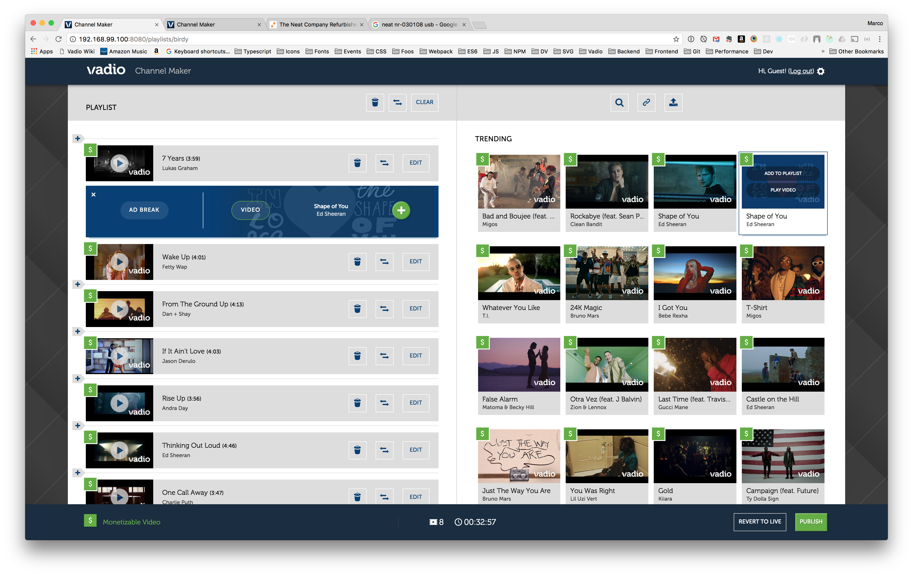
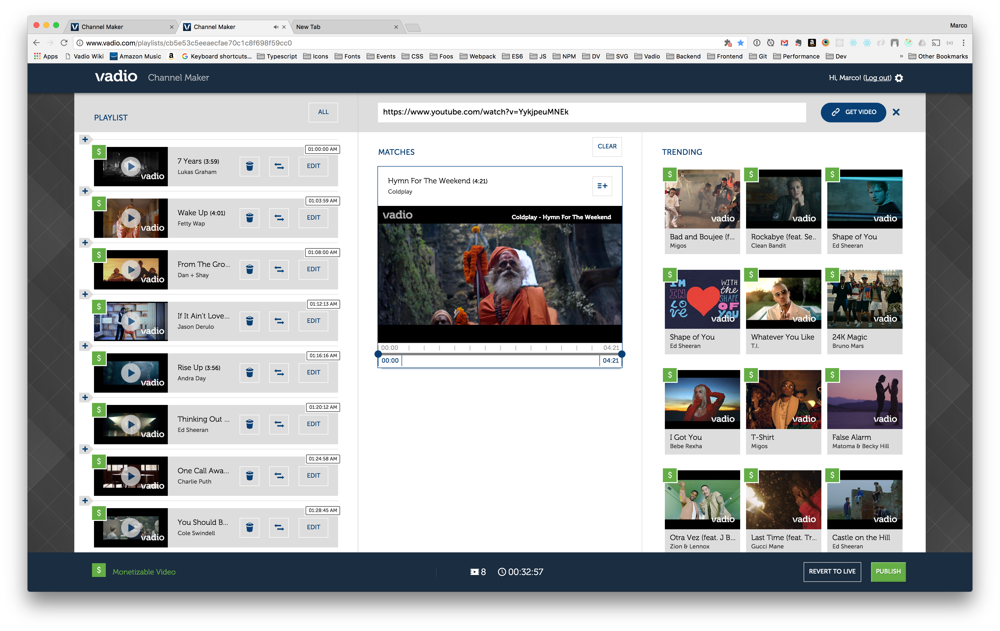
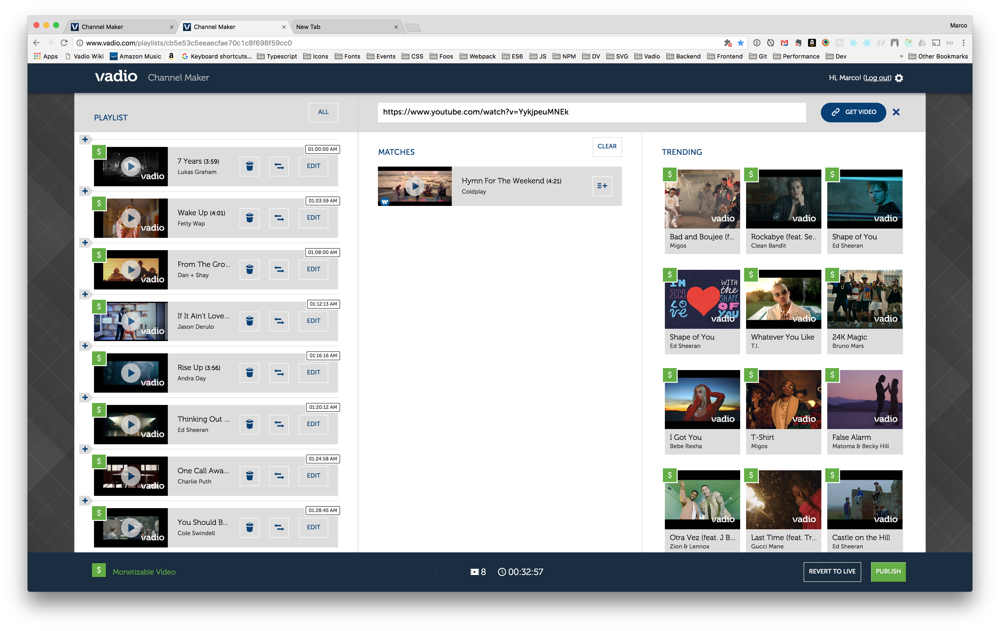

ChannelMaker provides a way for Vadio partners to generate custom playlists of music videos which are played through an embedded player. The React app integrates Vadio APIs for searching videos by artist and title, making recommendations, uploading playlists, and saving playlist drafts.

The Trending Panel pulls top watched videos from our Analytics API and filters by videos that can be advertised against. This gives partners the best shot at engaging users.

The Related Panel, displays recommended videos based on the users playlist item selection. When no items are selected, the Trending Panel reappears.

The Playlist and Results have an inline embedded player so that users can quickly view and edit a video.

The Inline Adding feature gives users control over ad placement, deciding where ads a placed and how long they will be. The feature also allows the user to add a selected video from Results, Related, or Trending panels to a specific spot in the playlist.

The Settings Panel provides the user more options for ads and playback behavior. The user can relinquish ad placement control to the video player which injects ads at a desired ratio. If the user wants to control the ads in the playlist, they have an autofill tool which will populate the playlist with :30 seconds ads at a given ratio.
