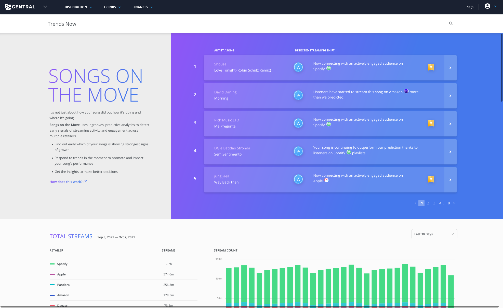
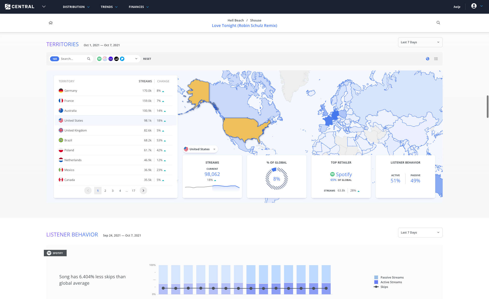

## An AI-powered music analytics tool for multiple streaming services

### Position

- Principal UI Developer

## Analysis

### Issues

#### It's clunky

The current analytics tool is slow due to the vast amount of data, poorly optimized searches and data aggregation, and old tech

#### No good place to start

Users sturggle to find and disect data, there's no good starting point

#### I don't understand

The current analytics tool doesn't provide any insights into what the data means

#### Data is missing

Users are mashing up individual streaming retailer data with data from disjointed internal sources to make sense of label, artist and song performance

### Solutions

#### Fast first

Leverage modern technology, from data collection to user interface, to deliver with minimal delay

#### Invite exploration

The new analytics dashboard encourages exploration via featured insights and more interactions

#### Say what it means

The new dashboard should emphasize insights over data

#### Tell the whole story

The new dashboard should provide retailer-specific and aggregate data across data ranges and territories to tell the story of the user, the labels, the artists and the songs